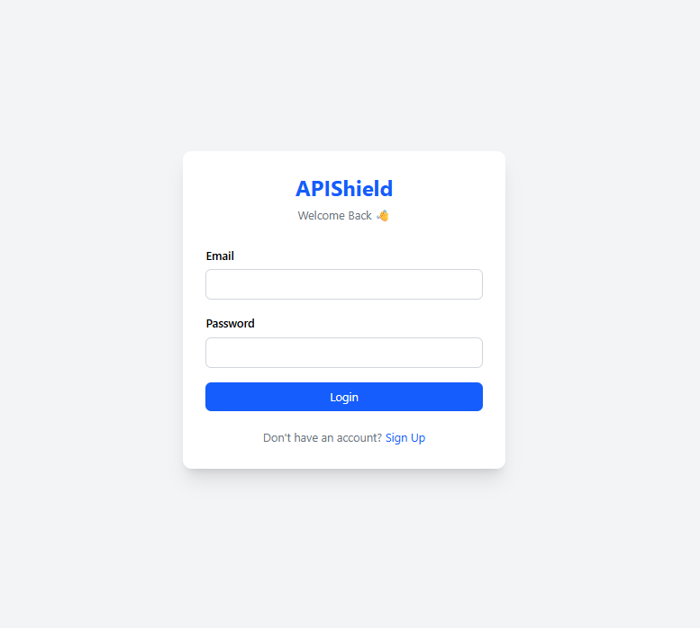
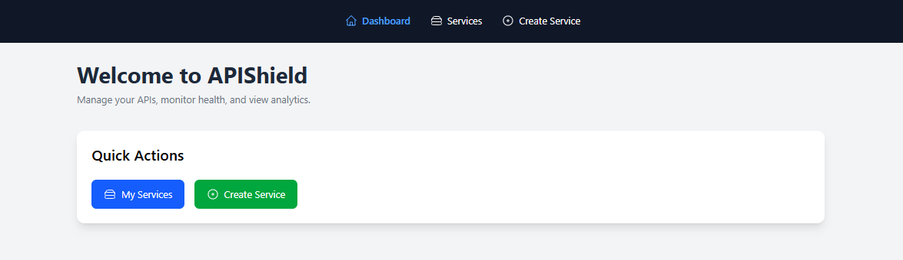
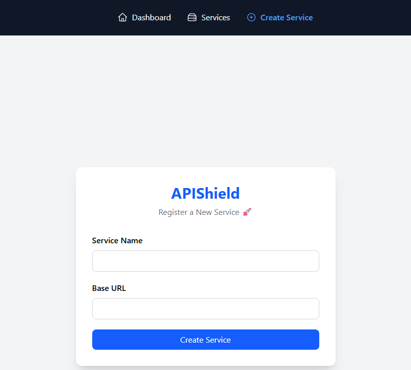
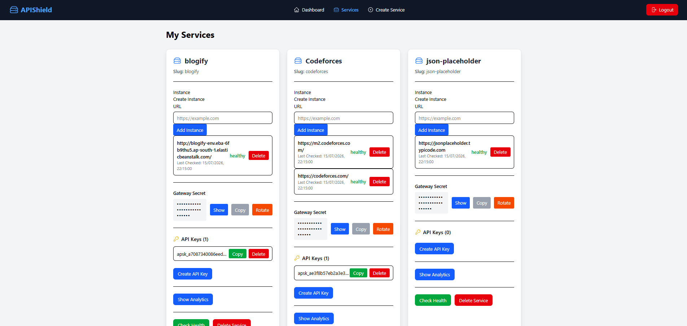

# 🛡️ APIShield

<p align="center">
  <h1 align="center">APIShield</h1>
  <p align="center">
    A Production-Ready API Gateway & API Management Platform
    <br />
    Securely expose backend services with API Keys, Request Forwarding,
    Health Monitoring, Load Balancing and Analytics.
  </p>
</p>

<p align="center">


</p>

---

# 🚀 Overview

APIShield is a full-stack API Gateway and API Management Platform built to securely expose backend services through a centralized gateway.

Instead of allowing clients to access backend services directly, APIShield validates API Keys, applies rate limits, forwards requests to healthy service instances, retries failed requests, records analytics, and continuously monitors service health.

The project demonstrates several production-level backend engineering concepts including reverse proxy architecture, Redis-backed rate limiting, round-robin load balancing, gateway authentication, health monitoring, analytics, and automated testing.

---

# 🌐 Live Demo

| Service | Link |
|----------|------|
| Frontend | https://api-shield-eight.vercel.app |
| Backend API | https://api-shield-1e4k.onrender.com |
| GitHub Repository | https://github.com/Vipulsnips/Api-Shield |

---

# 📸 Screenshots

## Login



---

## Dashboard



---

## Create Service



---

## Service Management

Shows:

- Multiple Backend Instances
- Gateway Secret
- API Keys
- Analytics
- Per-Instance Analytics
- Health Monitoring



---

# ✨ Features

## 🔐 Authentication

- User Registration
- User Login
- JWT Authentication
- Protected Routes

---

## 🚀 Service Management

- Register Backend Services
- Automatic Slug Generation
- Delete Services
- Ownership Validation
- Gateway Secret Generation
- Gateway Secret Rotation

---

## 🌐 Backend Instance Management

- Register Multiple Backend Instances
- Delete Instances
- Healthy / Unhealthy Status
- Last Checked Timestamp
- Manual Health Checks

---

## 🔑 API Key Management

- Generate API Keys
- Delete API Keys
- Copy API Keys
- API Key Validation

---

## 🌉 API Gateway

- Dynamic Request Forwarding
- Header Sanitization
- Gateway Secret Injection
- Retry Failed Requests
- Support for Query Parameters
- Support for Request Body
- Support for All HTTP Methods

---

## ⚖️ Reliability

- Redis Fixed Window Rate Limiting
- Round Robin Load Balancing
- Automatic Retry on Failed Instance
- Cron Based Health Monitoring

---

## 📊 Analytics

- Request Logging
- Total Requests
- Success & Failure Metrics
- Average Response Time
- Per-Instance Analytics

---

## 🛡️ Security

- JWT Authentication
- API Key Validation
- Gateway Secret Authentication
- SSRF Protection
- Ownership Based Authorization
- SSRF Protection — blocks `localhost`, loopback, and private/link-local IP ranges (including the cloud metadata endpoint range) when registering service URLs, restricted to `http(s)` only

---

# 🏗️ System Architecture

```text
                    React Dashboard
                           │
                           ▼
                  Express API Gateway
                           │
         ┌─────────────────┼─────────────────┐
         ▼                 ▼                 ▼
 Authentication      API Gateway      Analytics
                           │
                   MongoDB + Redis
                           │
                    Health Monitoring
```

---

# 🔄 Request Flow

```text
                 Client
                    │
                    ▼
             APIShield Gateway
                    │
        ┌───────────┼────────────┐
        │           │            │
        ▼           ▼            ▼
 Validate API   Rate Limit   Select Healthy
     Key          (Redis)      Instance
        │
        ▼
 Forward Request
        │
 Retry if Failed
        │
 Store Analytics
        │
        ▼
 Return Response
```

---

# 🛠️ Tech Stack

| Layer | Technology |
|--------|------------|
| Frontend | React, Tailwind CSS, Axios |
| Backend | Node.js, Express.js |
| Database | MongoDB Atlas |
| Cache | Redis (Upstash) |
| Authentication | JWT |
| Scheduler | node-cron |
| Testing | Jest, Supertest |
| CI/CD | GitHub Actions |
| Deployment | Render, Vercel |

---

# 🔐 Gateway Secret Authentication

Every registered service is assigned a unique Gateway Secret.

Retrieve the secret using:

```http
GET /api/services/:id/secret
```

When APIShield forwards a request, it automatically adds:

```http
x-gateway-secret: <service-secret>
```

Backend services should verify this header before processing requests to prevent clients from bypassing the gateway and directly accessing backend services.

---

# 🧪 Testing

APIShield includes automated unit and integration tests using **Jest** and **Supertest**.

Covered modules include:

- Authentication
- Services
- API Keys
- API Gateway
- Analytics

Run tests locally:

```bash
cd backend
npm test
```

---

# ⚙️ Continuous Integration

GitHub Actions automatically:

- Installs dependencies
- Runs all Jest test suites
- Verifies every push

---

# 💻 Local Setup

Clone the repository:

```bash
git clone https://github.com/Vipulsnips/Api-Shield.git

cd Api-Shield
```

Backend:

```bash
cd backend

npm install

npm run dev
```

Frontend:

```bash
cd frontend

npm install

npm run dev
```

---

# 🔑 Environment Variables

### Backend

```env
PORT=8000

MONGO_URL=your_mongodb_connection_string

JWT_SECRET=your_jwt_secret

REDIS_URL=your_upstash_redis_url
```

### Frontend

```env
VITE_API_URL=http://localhost:8000/api
```

---

# 📚 Concepts Demonstrated

- API Gateway Architecture
- Reverse Proxy Pattern
- JWT Authentication
- API Key Management
- Redis Rate Limiting
- Redis Round Robin Load Balancing
- Retry Mechanism
- Gateway Secret Authentication
- MongoDB Aggregation Pipelines
- Health Monitoring
- Express Middleware
- REST API Design
- GitHub Actions CI/CD
- Cloud Deployment

---

# 🚀 Future Enhancements

- Docker & Docker Compose
- OpenAPI / Swagger Documentation
- Kubernetes Deployment
- Prometheus Metrics
- Grafana Dashboard

---

# 👨‍💻 Author

**Vipul Rawat**

- GitHub: https://github.com/Vipulsnips
- LinkedIn: https://www.linkedin.com/in/vipul-rawat-codes

---

# ⭐ Support

If you found this project helpful, consider giving it a ⭐ on GitHub!